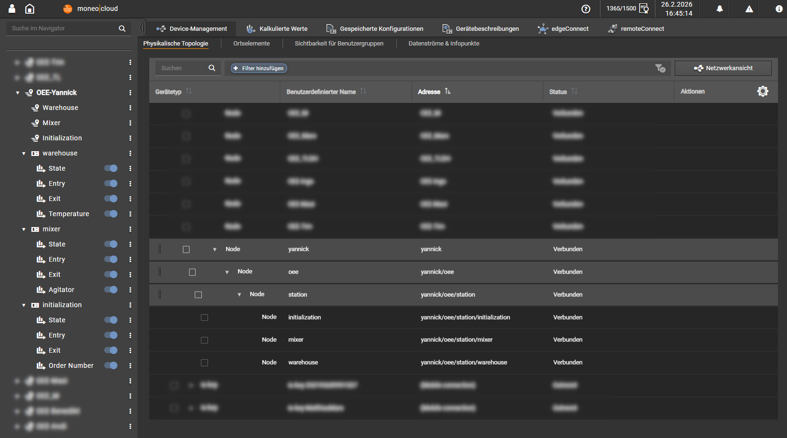
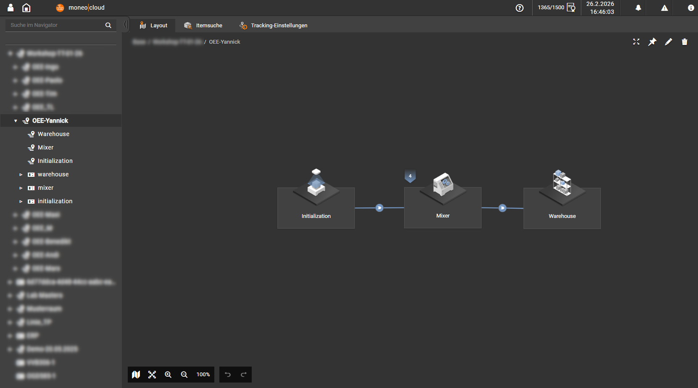
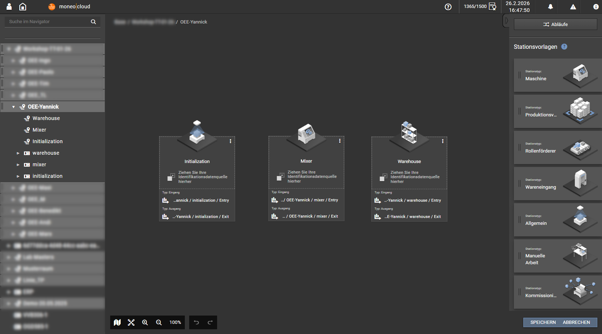
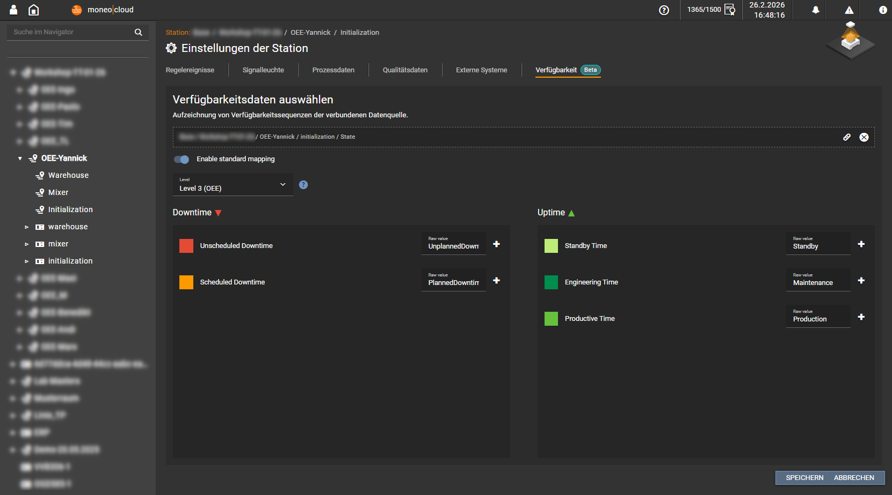

# moneo | track & trace simulator

A Windows desktop application to simulate industrial Track & Trace scenarios via MQTT for ifm moneo.

## Overview

The **moneo Track & Trace Simulator** mimics real-world RFID/Barcode scanning stations and machines in a factory environment. It publishes telemetry data, carrier events (Entry/Exit), attribute changes, and state updates to an MQTT broker, allowing you to test and demonstrate moneo Track & Trace without physical hardware.

### Key Features
- **Simulated Stations**:
  - **Initialization Station**: Simulates new carriers entering the process
  - **Mixer Station**: Simulates a processing machine with telemetry (speed) and state changes
  - **Warehouse Station**: Simulates a storage location with environmental monitoring (temperature)
- **MQTT Connectivity**: Full MQTT client support with TLS, authentication, and configurable topics
- **Dynamic Data**: Randomly generated telemetry values within configurable ranges
- **Easy Control**: GUI to trigger Entry/Exit events for specific carriers manually

## Download

Download the latest version from our **[Download Page](https://yannickdreher.github.io/moneo-track-trace-simulator/)**.

---

## Getting Started with moneo

Follow these steps to integrate the simulator with your moneo environment.

### 1. Onboard MQTT Broker in moneo

1. Open **moneo device management**
2. Navigate to your edge device you want to onboard a MQTT broker
   - Click "Add Device" and select "Plain MQTT" as the device type
   - Enter all MQTT connection details (Host, Port, Credentials) matching your broker setup
   - Click "OK" to save the device
3. Navigate to your new MQTT device and click "Add Device"
   - Enter the MQTT topic you want to subscribe to (e.g., `factory/demo`)

### 2. Onboard Data Sources (Topics)

You need to create data sources in moneo that subscribe to the simulator's topics.

**Default Base Topic:** `factory/demo`

#### Station 1: Initialization (`station/initialization`)
- **Topic:** `factory/demo/station/initialization`
- **Data Points to onboard:**
  - `Entry` (JSON path: `values[0].value` where `identifier`="Entry")
  - `Exit` (JSON path: `values[0].value` where `identifier`="Exit")
  - `Power` (Telemetry)
  - `OrderNumber` (Attribute)

#### Station 2: Mixer (`station/mixer`)
- **Topic:** `factory/demo/station/mixer`
- **Data Points to onboard:**
  - `Entry`
  - `Exit`
  - `AgitatorSpeed` (Telemetry)
  - `State`
  - `AgitatorId` (Attribute)

#### Station 3: Warehouse (`station/warehouse`)
- **Topic:** `factory/demo/station/warehouse`
- **Data Points to onboard:**
  - `Entry`
  - `Exit`
  - `Temperature` (Telemetry)

### 3. Configure moneo Track & Trace

1. Open **moneo Track & Trace**
2. Go to **Track & Trace** > **Layout**
   - Klick "Create Layout"
   - Drag & drop the stations from the right pane to the layout area:
     - Initialization → Common
     - Mixer → Machine
     - Warehouse → Warehouse

3. **Map Data Sources**
   - For each station, map the onboarded MQTT data points
   - Map the **Entry / Exit** events to the station's triggers:

4. **Map Availability Sources and Values**:

## Using the Simulator

1. **Settings**:
   - Launch the app and go to the **Settings** tab
   - Enter your MQTT Broker details (Host, Port, User, Password)
   - Set the Base Topic (default: `factory/demo`)
   - Click **Save**. The status bar should show "Connected"

2. **Simulation**:
   - Go to the **Simulation** tab
   - You will see the three stations
   - **Start Telemetry**: Click "Start" on a station to begin sending continuous data (Power, Speed, etc.)
   - **Move Carriers**:
     - Select one or more carriers (Default: CARRIER001, CARRIER002...)
     - Click **Send Entry** to simulate carriers arriving at the station
     - Click **Send Exit** to simulate carriers leaving the station
   - **Change State**: (Mixer only) Select a state (Running, Stopped, Error) and click "Set" to update the machine status

## Technology Stack
- **Framework**: .NET 10
- **UI**: WinUI 3 (Windows App SDK)
- **Protocol**: MQTTnet

## License
This project is licensed under the MIT License

---
*moneo® is a registered trademark of ifm electronic gmbh*